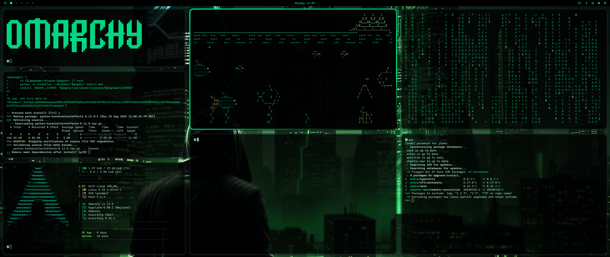

# Hakker Green Theme

A cohesive, modern desktop theme for Omarcy Linux systems using Wayland/Hyprland with a focus on aesthetics and productivity, featuring a vibrant green color scheme.

## Color Scheme

The hakker-green theme uses a carefully crafted green palette that provides excellent contrast and readability:

- **Background**: `#000000` (Pure black)
- **Primary Text**: `#00ff99` (Bright green)
- **Accents/Borders**: `#00cc77` (Medium green)
- **Highlights**: `#ccffee` (Light green-white)
- **Inactive Text**: `#1a1a1a` (Dark gray-black)

## Installation

### Prerequisites
- Archlinux [https://archlinux.org]
- Omarchy [https://omarchy.org/]

### Setup Instructions
```bash
omarchy-theme-install https://github.com/joaquinmeza/omarchy-hakker-green-theme
```

### Starship Configuration
To use the hakker-green theme with Starship prompt, set the environment variable:
```bash
export STARSHIP_CONFIG="$HOME/.config/omarchy/themes/hakker-green/starship.toml"
```

Add this line to your shell profile (`~/.bashrc`, `~/.zshrc`, or `~/.config/fish/config.fish`) for permanent setup.

For more information about Starship configuration, visit [https://starship.rs/](https://starship.rs/).

## Configuration Details

### Hyprland
- **Transparency**: Window opacity rules for different applications
- **Blur Effects**: Background blur with customizable intensity
- **Animations**: Smooth window transitions and workspace switching
- **Gestures**: 3-finger workspace swiping
- **Gaps**: Minimal gaps between windows for clean look

### Transparency Levels
- **Terminals**: 95% opacity
- **Code Editors**: 90% opacity
- **Browsers**: 95% opacity
- **Media Apps**: 80% opacity

### Blur Settings
- **Size**: 5px blur
- **Passes**: 1 pass for performance
- **Optimizations**: Enabled for better performance

## Customization

### Adding New Applications
To add transparency to new applications, add to `hyprland.conf`:
```bash
windowrulev2 = opacity 0.90 0.90,class:^(your-app)$
```

### Modifying Colors
All colors are defined in their respective configuration files:
- **waybar.css**: Status bar colors
- **wofi.css**: Launcher colors
- **alacritty.toml**: Terminal colors
- **kitty-theme.conf**: Kitty terminal colors
- **btop.theme**: System monitor colors
- **neovim.lua**: Editor colors
- **starship.toml**: Shell prompt colors

### Adjusting Transparency
Modify the opacity values in `hyprland.conf`:
```bash
# More transparent (lower values)
windowrulev2 = opacity 0.80 0.80,class:^(app)$

# Less transparent (higher values)
windowrulev2 = opacity 0.95 0.95,class:^(app)$
```

## Troubleshooting

### Common Issues

1. **Blur not working:**
   - Ensure your GPU supports hardware acceleration
   - Check if `new_optimizations = true` is set

2. **Transparency not applying:**
   - Verify the application class name is correct
   - Restart Hyprland after configuration changes

3. **Performance issues:**
   - Reduce blur size or passes
   - Disable animations if needed
   - Check GPU drivers

4. **Starship not loading:**
   - Verify the `STARSHIP_CONFIG` environment variable is set correctly
   - Check that the starship.toml file exists in the specified path
   - Restart your terminal after setting the environment variable

### Performance Tips
- Use `disable_direct_scanout = true` for better transparency
- Adjust blur settings based on your hardware
- Monitor system resources with `btop`

## File Structure
```
omarchy-theme-hakker-green/
├── hyprland.conf            # Window manager configuration
├── waybar.css               # Status bar styling
├── wofi.css                 # Application launcher styling
├── hyprlock.conf            # Screen locker configuration
├── mako.ini                 # Notification daemon settings
├── alacritty.toml           # Terminal emulator colors
├── kitty-hakker-theme.conf  # Kitty terminal colors
├── neovim.lua               # Text editor colorscheme
├── starship.toml            # Shell prompt configuration
├── btop.theme               # System monitor theme
└── README.md                # This file
```

## Acknowledgments

- Inspired by modern desktop aesthetics
- Built for productivity and visual appeal
- Designed for Omarchy ecosystem but can be used in Wayland/Hyprland ecosystem
- Starship prompt integration for enhanced shell experience

## Disclaimer
The images were created in Gemini. The files were modified, with prompt instructions, utilizing claude-sonnet

## Bonus
I've added both a kitty and starship files to go with these themes.  By default, these 2 do not come with omarchy

---

**Enjoy your hakker-green themed desktop!** 
